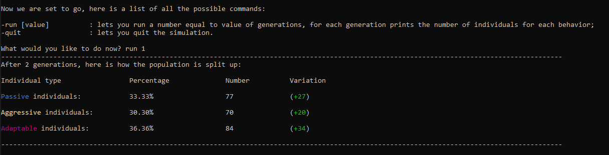
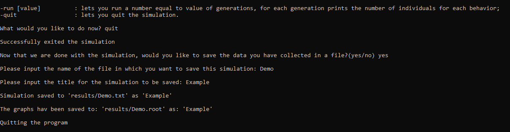
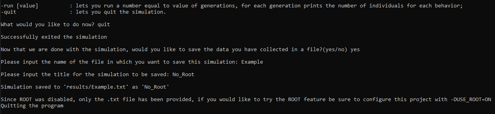
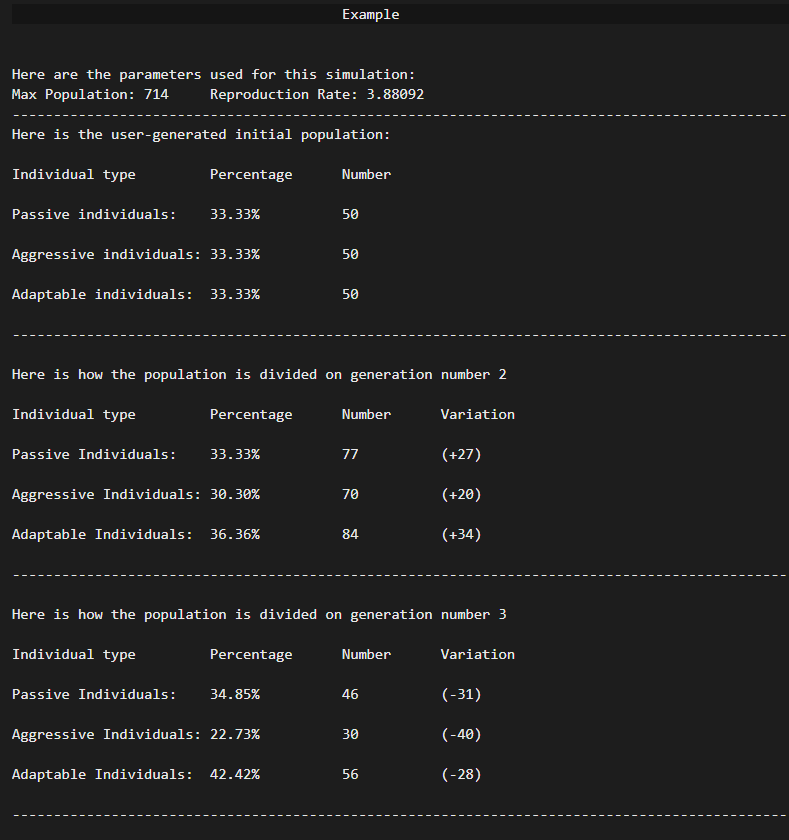
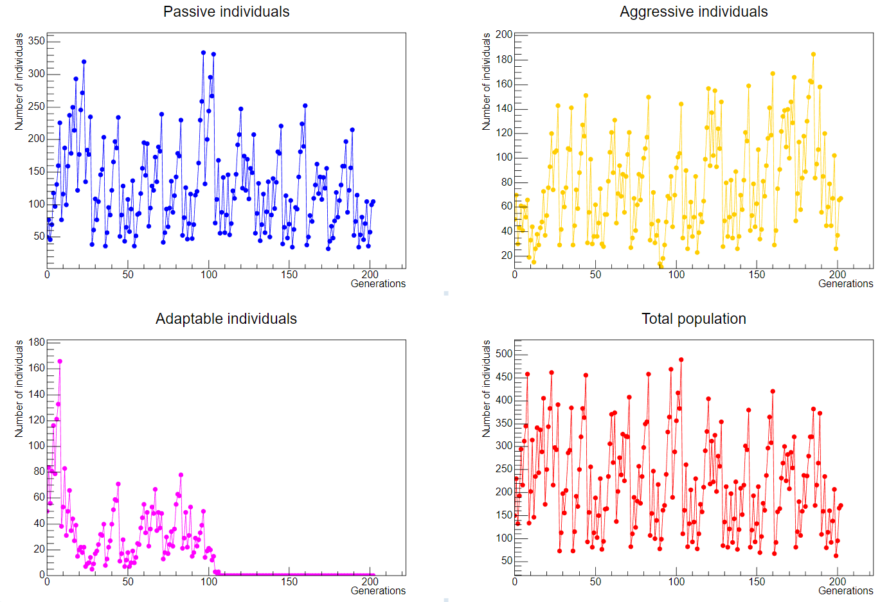
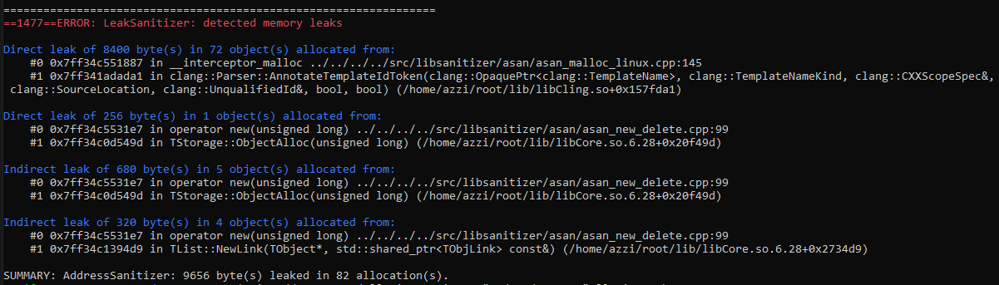

# Evoluzione comportamentale

# Relazione del progetto

### Realizzato da Azzano Michele

[Link per GitHub](https://github.com/SomeItalianGuy/Esame_Azzano)

## Contenuti

- [**Introduzione**](#introduzione)
- [**Metodi implementativi**](#metodi-implementativi)
    - [**Struttura del progetto**](#struttura-del-progetto)
    - [**Implementazione della popolazione**](#implementazione-della-popolazione)
    - [**Implementazione della simulzione**](#implementazione-della-simulzione)
- [**Come compilare**](#come-compilare)
- [**Interazione con il programma**](#interazione-con-il-programma)
    - [**Input**](#input)
    - [**Output**](#output)
    - [**Analisi dati**](#analisi-e-interpretazione-dati)
- [**Modalità di test**](#modalità-di-test)
- [**Avvertenze**](#avvertenze)
    - [**Possibile lancio di domain error**](#possibile-lancio-di-domain-error)
    - [**Framework di ROOT**](#framework-di-root)
    - [**Estensioni consigliate**](#estensioni-consigliate)
    - [**Errori previsiti**](#errori-previsti)
- [**Link Utili**](#link-utili)

## Introduzione

Lo scopo principale del programma da me presentato è quello di simulare l'evoluzione del comportamento di una popolazione di individui.  
In questo contesto si considerano individui capaci di uno solo di tre comportamenti:  

- Passivo, l'individuo eviterà i conflitti per cercare di dividere equamente il cibo;
- Aggressivo, l'individuo tende a prendere la maggior parte del cibo per sè, ma perderà molte energie se dovesse entrare in competizione;
- Adattabile, l'individuo apprezzerà l'altruismo del Passivo, lasciandogli più cibo, se dovesse incontrare un individuo aggressivo prenderà la maggior parte del cibo.

Dato questo setup, simile a "Sasso, Carta, Forbice", dove ciacuna opzione ha una forza e una debolezza, si lasciano passare le generazioni desiderate e si nota come la popolazione sia evoluta.  
In questa simulazione si considera l'assenza di altri esseri viventi e una proporzionailtà diretta tra cibo trovato e possibilità di sopravvivenza/riproduzione.  
Per la relaizzazione del progetto ho considerato un sistema dove, per ogni generazione, viene creata una certa quantità di luoghi, ciascuno dei quali contenenti due unità di cibo.  
A questo punto ciascun individuo, in maniera casuale, si dirige a uno di questi luoghi, se questo individuo fosse solo, allora tornerà a casa con due unità di cibo e sarà sicuro di sopravvivere e riprodursi, se invece incontrasse un altro individuo allora vi sarà un'interazione basata sulle personalità dei due contendenti per decidere come dividersi le vivande.  
Verranno dunque calcolate, su base casuale, la sopravvivenza e la riproduzione di ciascun individuo, dunque vengono stampati a schermo i risultati generazione per generazione.  
Alla fine della raccolta dati verrà data l'opzione di salvare questi su un file di testo e, se l'opzione per usare root fosse abilitata, stampare grafici relativi all'andamento della popolazione. 

## Metodi implementativi

### Struttura del progetto

Per realizzare il progetto ho sfruttato diverse classi: 

- Individual: si occupa di definire i singoli individui;
- Population: gestisce una moltitudine di individui;
- RNGHelper: generazione di numeri pseudo-casuali;
- RootHelper: ha il compito di disegnare grafici;
- Simulation: gestisce le interazioni fra le altre classi.

In più ho aggiunto alcuni namespace con funzioni per rendere più pulito il codice:

- Logic: si occupa di input e generazione di vettori;
- Graphic: si occupa della stampa a schermo

### Implementazione della popolazione

Al fine di rendere questa simulazione più verosimile, ho messo dei limiti alla quantità di individui della popolazione.  
Il primo limite è quello assoluto, si considera un ambiente dove il cibo non è infinito, dunque la popolazione non potrà mai superare una certa soglia, che ho deciso di chiamare `Population::maxPopulation_`.  
Il secondo è la popolaizone massima per ciascuna generazione, calcolata tramite un semplice prodotto tra la popolazione massima sopra citata e una percentuale che varia da generazione a generazione, si ottiene tramite il metodo `Population::Get_genMaxPopulation()`.  
Per imitare la variabilità delle condizioni ambientali, con periodi più prosperi e periodi con meno risorse, ho sfruttato una mappa logistica ([Link se si desiderasse approfondire l'argomento](#mappa-logistica)), nello specifico la parte caotica di tale mappa per calcolare la percentuale utilizzata da `Population::Get_genMaxPopulation()`.

### Implementazione della simulzione

Ritengo sia necessario spendere alcune parole per spiegare alcuni metodi che potrebbero non essere evidenti a prima vista.  
Per quanto riguarda gestire la popolazione massima, sono arrivato alla conclusione di due possibilità:  
- Impedire le nascite quando si supera la soglia della popolazione massima;  
- Rimuovere individui una volta superata la suddetta soglia.
In questo caso ho ritenuto più corretto usare la seconda, in quanto imita il fatto che alcuni individui possano morire per cause al di fuori della mancanza di cibo. L'inconveniente di questa scelta è il fatto che, come ne discuterò meglio nella parte di [analisi](#analisi-dati), la simulazione diventi imprevedibile.
Per quanto riguarda `Simulation::SetRandomPlaces`, questo metodo fa uso del vettore `s_idList`, ovvero il vettore che contiene tutti gli identificativi relativi ad ogni individuo della popolazione e per ciascuno di questi viene assegnato a un luogo casuale.    
Per quanto riguarda il calcolo della sopravvivenza degli individui ho sfruttato il metodo `Simulation::GenerateNextGeneration`, il quale sfrutta la generazione di numeri pseudo-casuali, infatti il cibo raccolto è stato ideato in questa maniera:  
- 0-1 Probabilità di sopravvivenza;
- 1-2 Probabilità di riproduzione.
Dunque è semplicemente necessario prendere un numero casuale tra 0 e 1, controllare se questo è minore del valore di cibo (per la riproduzione ovviamente si riduce di una unità il cibo) e in tal caso si ha successo.  

## Come compilare

| Azione | Comando |
|--------|---------|
| Configurare CMake | `cmake -B "path-to-build" -S .` |
| Abilitare/Disabilitare ROOT | `-DUSE_ROOT=ON` / `-DUSE_ROOT=OFF` | 
| Abilitare/Disabilitare i test | `-DBUILD_TESTING=ON` / `-DBUILD_TESTING=OFF` | 
| Buildare i file, creare e linkare l'eseguibile | `cmake --build "path-to-build"` |
| Eseguire il programma principale | `./"path-to-build"/main` |
| Eseguire i test | `./"path-to-build"/main.test` |

Si noti che:

- Il comando per abilitare/disabilitare opzioni deve essere chiamato in contemporanea alla configurazione di CMake;
- In diversi comandi è necessario sostiutire "path-to-build" con il path alla cartella all'interno della quale si desidera avere gli eseguibili.

## Interazione con il programma

### Input

Per l'input sarà sufficiente seguire le istruzioni che verranno date a schermo durante il *runtime*, verranno chiesti, in ordine:

- Seed, necessario alla generazione di numeri pseudo-casuali;
- Numero iniziale di individui passivi;
- Numero iniziale di individui aggressivi;
- Numero iniziale di individui adattabili;
- Comando per far procedere la simulazione;
- Se si desidera salvare i risultati su un file;
- Nome del file in cui salvare i dati;
- Nome da dare alla simulazione, si noti che si può usare lo stesso file più volte;

### Output

A livello di *output* vi è la necessità di distinguere tra il terminale e i file generati.  
Quando vengono fatte girare un certo numero di generazioni, ci si può aspettare un risultato simile a:  

  

Una volta che si è soddsfatti della quantità di dati raccolti, si può passare alla fase di salvataggio della simulazione:  

  

Oppure, nel caso in cui non si sia utilizzato ROOT, si avrà:  

  

Se invece non si è soddisfatti della quantità di dati raccolti, si può sempre evitare di salvare, in tal caso il programma verrà immediatamente chiuso.  
Una volta salvati i file, questi verranno creati all'interno della cartella `results/`, che verrà creata in automatico se non fosse esistente, nell'esempio seguente ho dato al file il nome "Demo":  

  

Consiglio di usare il file `.txt` se si fosse interessati ad un'analisi quantitativa dei dati, se si fosse interessati solo ad una analisi qualitativa allora il file `.root` sarà più che sufficiente, lascio di seguito degli esempi di questi ultimi:  

- File `.txt`  

  

- File `.root`  

  

### Analisi e interpretazione dati

Come anticipato nella parte relativa all'implementazione della [simulazione](#implementazione-della-simulzione), non è possibile prevedere il preciso andamento della popolazione, la miglior stima che si può fare è sulla popolazione totale, che ci si aspetta abbia un comportamento simil-ondulatorio, con generazioni che fanno da picchi e  generazioni più "depresse".  
Questo a causa della morte casuale di individui per via della mia decisione su come limitare la popolazione.  
Un'esperimento interessante che si può fare partendo da questo programma è vedere cosa succede modificando i valori del cibo ottenuto dalle interazioni tra individui.  
L'idea sarebbe quella di andare a calcolare il cibo medio preso da un tipo di indiviui, tramite il calcolo:  

> $M_x = P_x \times C_{x-x} + P_y * C_{x-y} + P_z * C_{x-z}$

<!-- TODO Scrivere questa parte -->

## Modalità di test

Per assicurare il corretto funzionamento della maggior parte delle funzioni e dei metodi ho abilitato diversi test fatti con l'utilizzo di docTest.  
I test sono divisi in base alla classe o *namespace*, un'altra suddivisione viene fatta per il singolo pezzo di codice il cui funzionamento è messo alla prova. La maggior parte di questi test sono `CHECK_THROWS`, ovvero controlli che, in determinate condizioni, il codice lanci errori, questo è stato inevitabile, essendo il mio programma un sistema caotico, non è facile prevedere i risultati finali e la maggior parte dei controlli sono da fare al *runtime*.  

## Avvertenze

### Possibile lancio di domain error

C'è una minuscola probabilità che venga lanciato un errore dal metodo `Population::Calculate_currentPercentage`, trovato a linea 142 di `population.cpp`.  

> if (currentPercentage_ > 1 || currentPercentage_ < 0) {
>    throw std::domain_error(
>        "Current percentage is larger than 1, simulation cannot continue\n");
>  }
 
Questo errore potrebbe essere lanciato nel caso in cui dei prodotti tra `Population::currentPercentage_` e `Population::reproductionRate_` sia maggiore di 1 o minore di 0, in tutte le prove che ho fatto non è mai stato lanciato questo errore, mi sembra però corretto specificare che nel caso questo succeda sarà sufficiente riprovare a far girare il programma.

### Framework di ROOT

Per il corretto funzionamento di questo progetto sarà necessario avere installato il *framework* di ROOT, nel caso in cui non lo si avesse ancora installato, si può trovare una guida [qui](#guida-installazione-root)

### Estensioni consigliate

Dal momento che viene creato un file root, sarà necessaria un'estensione di VSCode, mi sento di raccomandare l'estensione che ho utilizzato durante lo sviluppo di questo progetto, ROOT File Viewer.  

### Errori previsti

Di seguito lascio un possibile errore che verrà dato nel caso si utilizzi un eseguibile abilitando ROOT, la causa di questo è il framework di ROOT, poiché questo istanzia dei puntatori a oggetti globali la cui memoria non viene deallocata, il codice funziona perfettamente fino al momento della cancellazione degli oggetti, a questo punto darà errore:

  

Se si volesse sfruttare il programma senza ricevere questo tipo di errore allora sarà necessario disabilitare root, il comando atto a questo scopo può essere trovato [qui](#come-compilare).

## Link utili

###### Mappa logistica
- [Pagina wikipedia](https://it.wikipedia.org/wiki/Mappa_logistica)
- [Video youtube consigliato](https://www.youtube.com/watch?v=ovJcsL7vyrk)

###### Guida installazione ROOT
- [Sito ufficiale ROOT](https://root.cern/install/)

[Premi qui](#contenuti) per tornare all'indice.